# SYSTEM ARCHITECTURE & DIAGRAMS
## Aplikasi: Sistem Informasi Manajemen Antrean Hybrid (3 Loket Kasir)

---

> **Petunjuk AI Agent / Developer:**  
> File ini berisi seluruh model diagram perancangan sistem berbasis **Mermaid.js** dan **PlantUML**. Seluruh diagram telah diselaraskan dengan spesifikasi 3 tabel final (`loket`, `antrian`, `admin`), zero-password session lock untuk kasir, dan mekanisme real-time AJAX/Fetch API tanpa refresh.

---

## 1. DIAGRAM KONTEKS (CONTEXT DIAGRAM)

### Mermaid Format
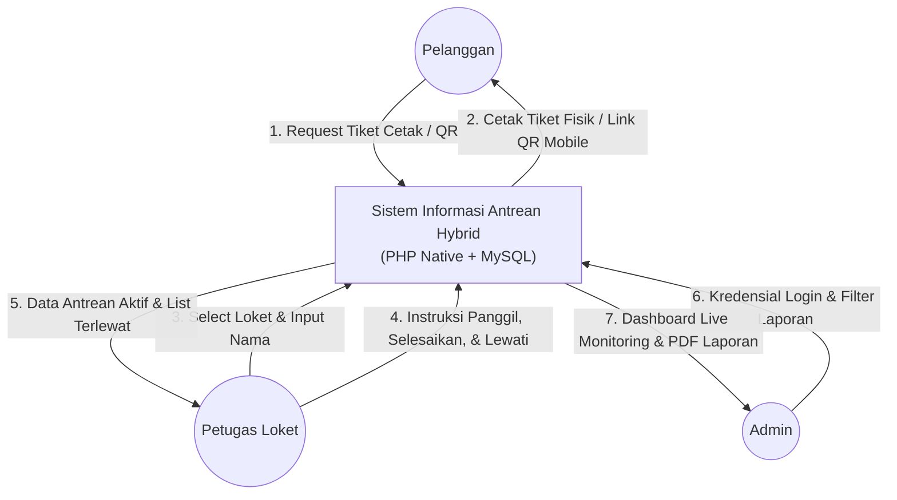

### PlantUML Format
```plantuml
@startuml
skinparam componentStyle rectangle

actor "Pelanggan" as pelanggan
actor "Petugas Loket" as petugas
actor "Admin" as admin

rectangle "Sistem Informasi Antrean Hybrid
(PHP Native + MySQL)" as sistem

pelanggan -> sistem : 1. Permintaan Tiket (Cetak / QR)
sistem -> pelanggan : 2. Cetak Tiket Fisik / Link QR Status Mobile

petugas -> sistem : 3. Input Nama & Pilih Loket (Session Init)
4. Instruksi Panggil, Selesaikan, & Lewati
sistem -> petugas : 5. Data Antrean Aktif & List Terlewat

admin -> sistem : 6. Kredensial Login & Request Filter Laporan
sistem -> admin : 7. Dashboard Live Monitoring & File Export PDF Eksekutif
@enduml
```

---

## 2. DFD LEVEL 0 (OVERVIEW PROCESS)

### Mermaid Format
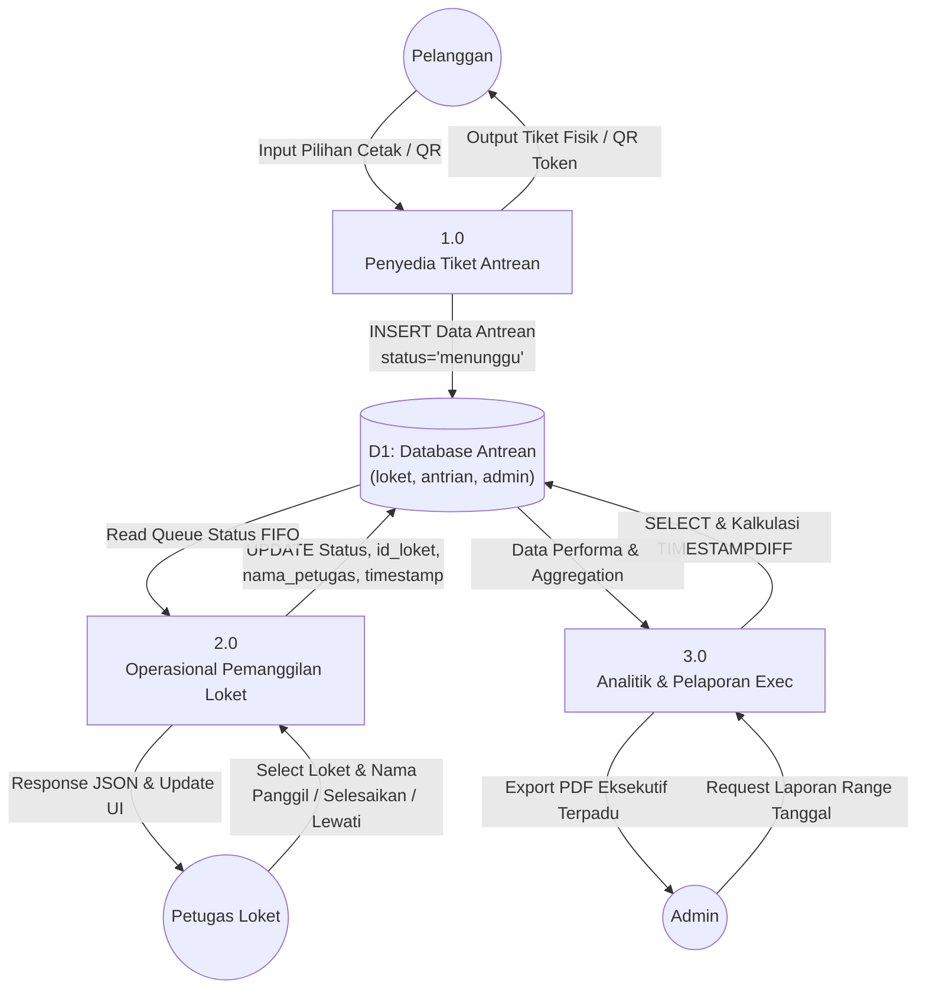

### PlantUML Format
```plantuml
@startuml
skinparam componentStyle rectangle

actor "Pelanggan" as pelanggan
actor "Petugas Loket" as petugas
actor "Admin" as admin

database "D1: Database Antrean
(loket, antrian, admin)" as DB

rectangle "1.0
Penyedia Tiket Antrean" as P1
rectangle "2.0
Operasional Pemanggilan Loket" as P2
rectangle "3.0
Analitik & Pelaporan Exec" as P3

' Process 1.0
pelanggan -> P1 : Input Pilihan (Cetak / QR)
P1 -> DB : INSERT Data Antrean
(status='menunggu', waktu_ambil=NOW())
P1 -> pelanggan : Tiket Fisik / Output Link QR

' Process 2.0
petugas -> P2 : Select Loket & Nama
Panggil / Selesaikan / Lewati
P2 -> DB : UPDATE Status Antrean, id_loket,
nama_petugas, waktu_panggil/selesai
DB -> P2 : Read Queue Status FIFO
P2 -> petugas : Response JSON & Update UI

' Process 3.0
admin -> P3 : Request Laporan (Range Tanggal)
P3 -> DB : SELECT & Kalkulasi TIMESTAMPDIFF
DB -> P3 : Data Performa & Aggregation
P3 -> admin : Export PDF Eksekutif Terpadu
@enduml
```

---

## 3. DFD LEVEL 1

### 3.1 DFD Level 1 (Proses 1.0 Ambil Nomor Antrean)

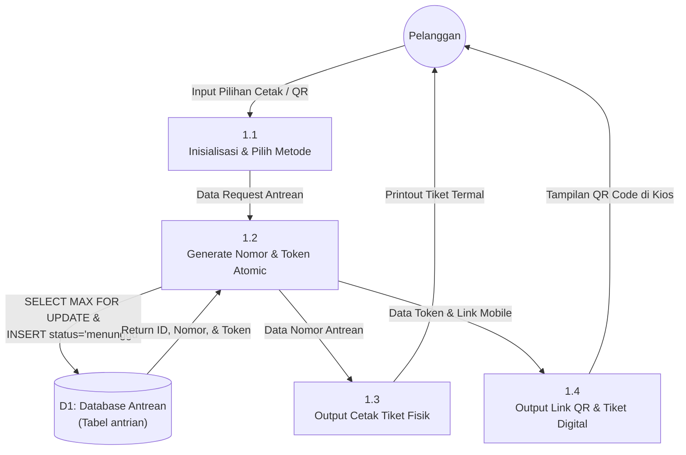

### 3.2 DFD Level 1 (Proses 2.0 Operasional Pemanggilan)

```mermaid
graph TD
    Petugas((Petugas Loket))
    DB[("D1: Database Antrean<br/>(loket, antrian)")]

    P21["2.1<br/>Setup Session & Lock Guard"]
    P22["2.2<br/>Fetch Queue FIFO (FOR UPDATE)"]
    P23["2.3<br/>Update Status Dipanggil"]
    P24["2.4<br/>Finalisasi Status (Selesai/Terlewat)"]
    P25["2.5<br/>Panggil Kembali (Recall / Terlewat)"]

    Petugas -->|Select No Loket & Nama| P21
    P21 -->|Check & Set session_token & last_seen| DB
    DB -->|Session Approved| P21

    Petugas -->|Klik 'Panggil Berikutnya'| P22
    P22 -->|Query status='menunggu' ORDER BY id ASC| DB
    DB -->|Return Row Antrean Terkecil| P22

    P22 -->|Trigger Update| P23
    P23 -->|UPDATE status='dipanggil', waktu_panggil=NOW()| DB

    Petugas -->|Klik 'Selesai' / 'Lewati'| P24
    P24 -->|UPDATE status='selesai'/'terlewat', waktu_selesai=NOW()| DB

    Petugas -->|Klik 'Panggil Ulang' / 'Panggil Terlewat'| P25
    P25 -->|UPDATE Status Antrean Terlewat| DB
```

### 3.3 DFD Level 1 (Proses 3.0 Monitoring & Pelaporan Exec)

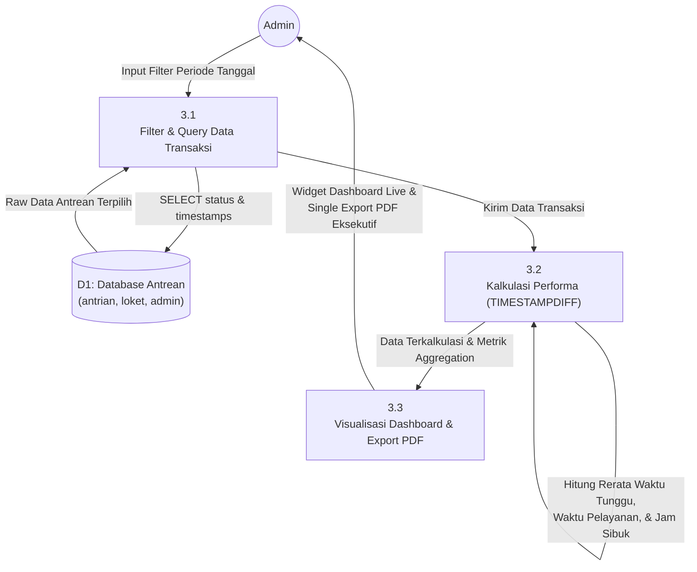

---

## 4. USE CASE DIAGRAM

### Mermaid Format
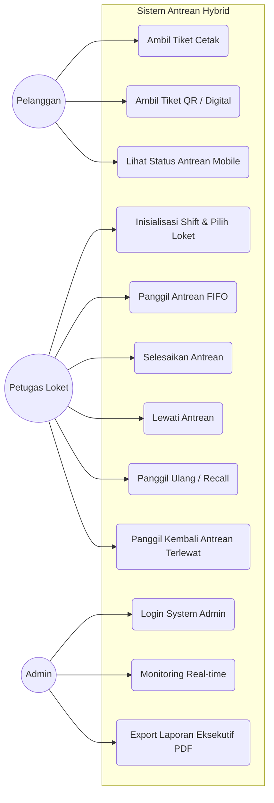

### PlantUML Format
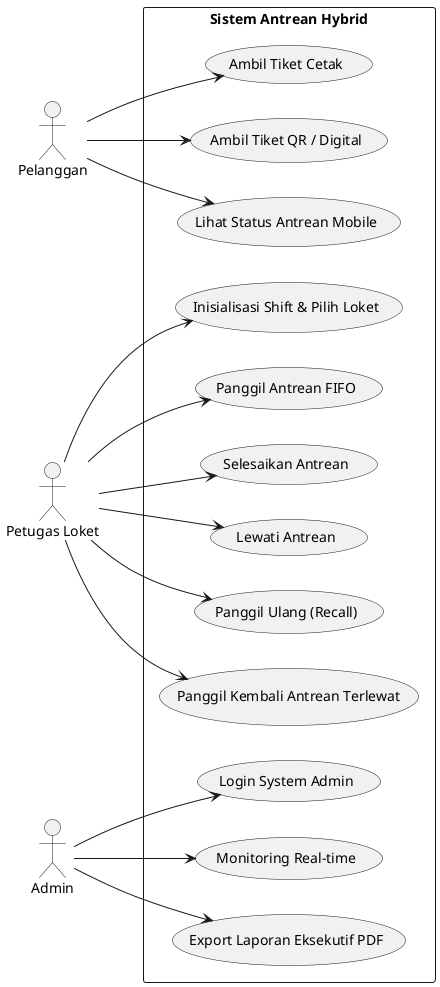

---

## 5. SEQUENCE DIAGRAMS (REAL-TIME COMMUNICATION)

### 5.1 Pengambilan Tiket & Live Polling Mobile

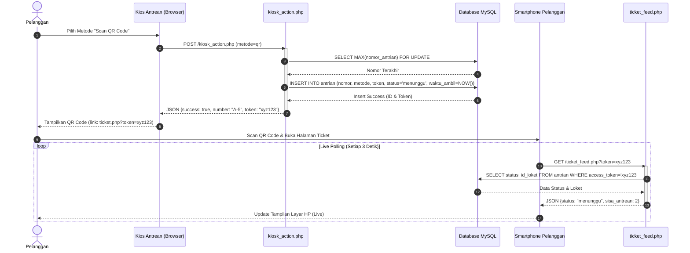

### 5.2 Pemanggilan Antrean FIFO & Lock Check

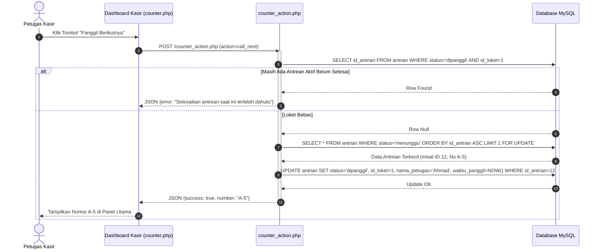

### 5.3 Layar Display Ruang Tunggu & Audio Trigger

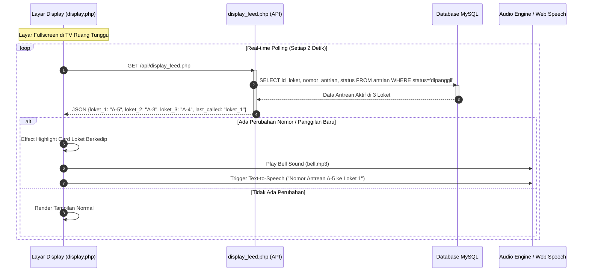

---

## 6. SYSTEM FLOWCHART

### Mermaid Format
```mermaid
flowchart TD
    Start([Mulai]) --> Setup[Petugas Memilih Nomor Loket 1-3 & Input Nama]
    
    Setup --> CheckLock{Apakah Loket Sedang<br/>Aktif Dipakai?}
    CheckLock -- Ya --> AlertLock[Tampilkan Alert 'Loket Sedang Digunakan'] --> EndSetup([Stop])
    CheckLock -- Tidak --> SaveSession[Simpan Session PHP & Set Lock Timestamp]

    SaveSession --> Kiosk[Pelanggan Memilih Metode Antrean]
    
    Kiosk --> Method{Metode Tiket?}
    Method -- Scan QR --> GenToken[Generate Access Token Unik]
    GenToken --> SaveDB1[Simpan Data ke DB: status='menunggu']
    SaveDB1 --> ShowQR[Tampilkan QR Code ke Smartphone]
    
    Method -- Cetak Fisik --> SaveDB2[Simpan Data ke DB: status='menunggu']
    SaveDB2 --> PrintTicket[Cetak Tiket Fisik via Thermal Printer]

    ShowQR --> CallStep[Petugas Klik 'Panggil Berikutnya']
    PrintTicket --> CallStep

    CallStep --> CheckQueue{Ada Antrean Status<br/>'menunggu'?}
    CheckQueue -- Tidak --> EmptyAlert[Notifikasi 'Antrean Kosong']
    CheckQueue -- Ya --> GetFIFO[Sistem Ambil Nomor Terkecil FIFO]
    
    GetFIFO --> CallActive[Update status='dipanggil' & waktu_panggil=NOW()]
    CallActive --> SoundBell[Display Utama Memutar Bel & Highlight Loket]
    
    SoundBell --> Attendance{Pelanggan Hadir<br/>di Loket?}
    Attendance -- Ya --> Process[Proses Pelayanan Kasir]
    Process --> Finish[Petugas Klik 'Selesai']
    Finish --> SaveFinish[Update status='selesai' & waktu_selesai=NOW()]
    
    Attendance -- Tidak --> Skip[Petugas Klik 'Lewati']
    Skip --> SaveSkip[Update status='terlewat' & waktu_selesai=NOW()]

    SaveFinish --> AdminReport[Admin Login Dashboard & Filter Tanggal]
    SaveSkip --> AdminReport

    AdminReport --> CalcMetrics[Sistem Hitung TIMESTAMPDIFF Waktu Tunggu/Layanan]
    CalcMetrics --> ExportPDF[Export 1 File PDF Laporan Eksekutif] --> End([Selesai])
```

---

## 7. ERD / CLASS DIAGRAM (SKEMA 3 TABEL FINAL)

### Mermaid Format
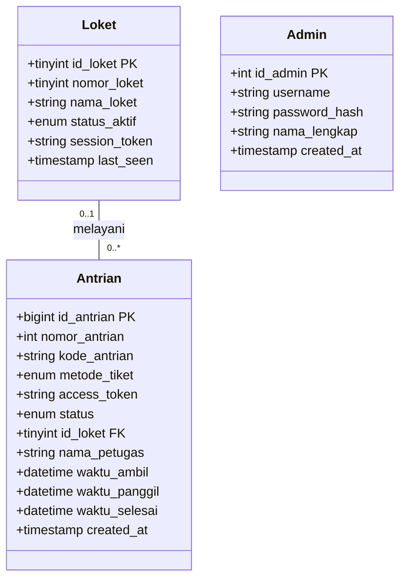

### PlantUML Format
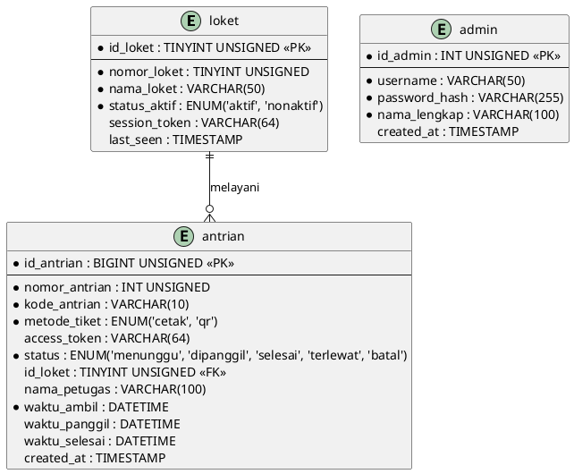
