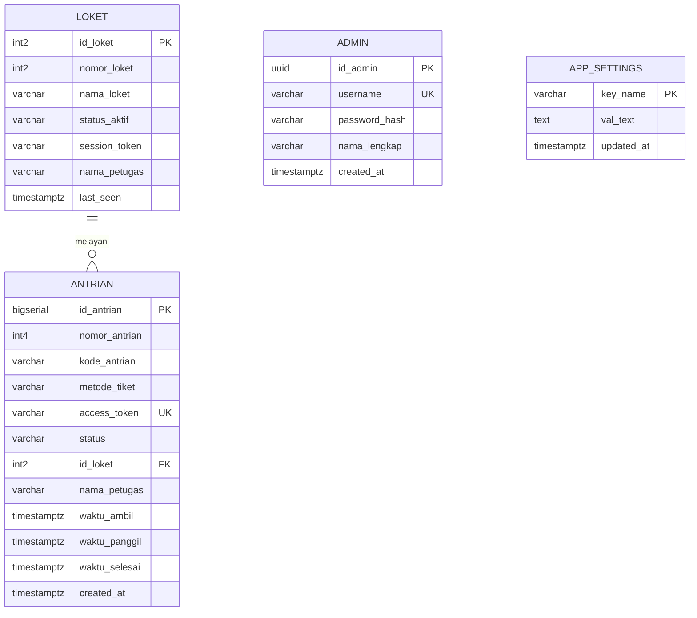
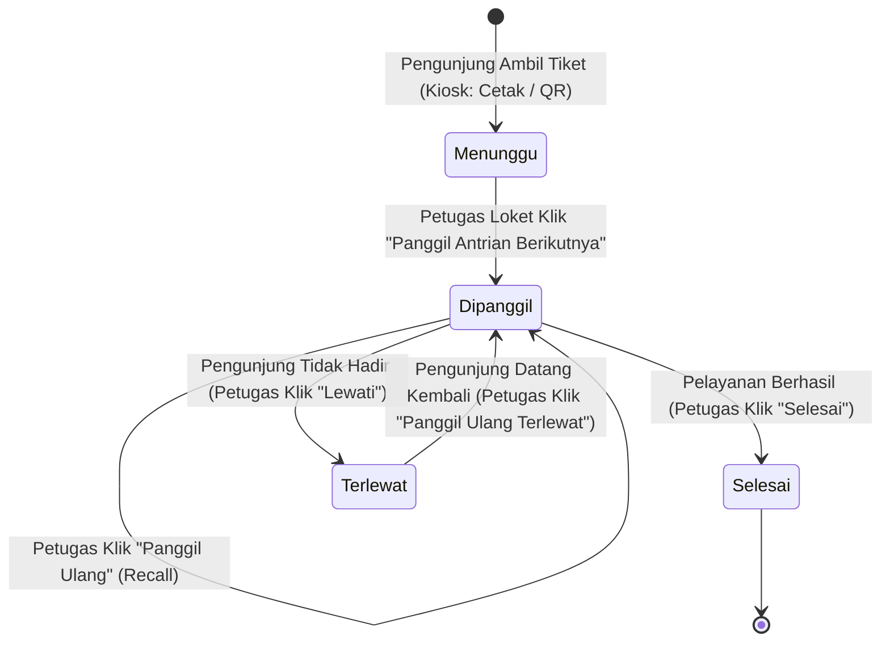
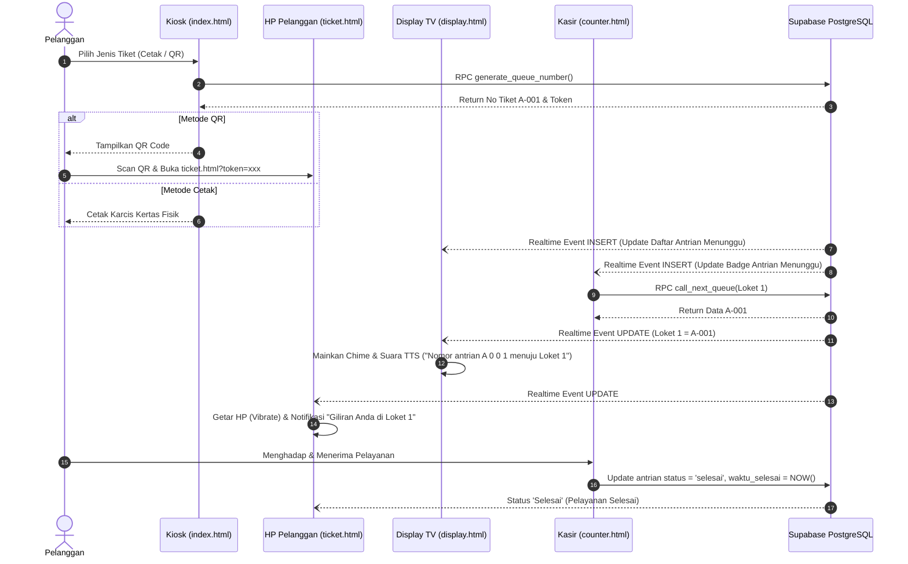

# DOKUMENTASI LENGKAP & SPESIFIKASI SISTEM
## SISTEM INFORMASI MANAJEMEN ANTRIAN HYBRID (SIMAH)

> **Dokumen ini dirancang sebagai Single Source of Truth (SSOT) teknis dan fungsional proyek.**
> Dokumen ini memuat seluruh penjelasan arsitektur, alur data (end-to-end lifecycle), skema basis data, logika RPC, interaksi antar-modul, diagram sistem, serta panduan komprehensif untuk membantu penyusunan laporan proyek/tugas akhir/skripsi.

---

## DAFTAR ISI
1. [BAB 1: INFORMASI UMUM & LATAR BELAKANG](#1-informasi-umum--latar-belakang)
2. [BAB 2: ARSITEKTUR SISTEM & INFRASTRUKTUR TEKNOLOGI](#2-arsitektur-sistem--infrastruktur-teknologi)
3. [BAB 3: PERANCANGAN BASIS DATA & LOGIKA RPC](#3-perancangan-basis-data--logika-rpc)
4. [BAB 4: DIAGRAM & SIKLUS ALUR KERJA (END-TO-END FLOW)](#4-diagram--siklus-alur-kerja-end-to-end-flow)
5. [BAB 5: RINCIAN IMPLEMENTASI MODUL (CODE LEVEL)](#5-rincian-implementasi-modul-code-level)
6. [BAB 6: TEMPLATE & REFERENSI PENYUSUNAN LAPORAN](#6-template--referensi-penyusunan-laporan)

---

## 1. INFORMASI UMUM & LATAR BELAKANG

### 1.1 Latar Belakang Masalah
Pada sistem antrian pelayanan publik konvensional, terdapat beberapa kelemahan mendasar:
1. **Keterikatan Fisik Pelanggan**: Pelanggan terpaksa harus duduk diam di ruang tunggu agar tidak terlewat mendengar panggilan loket.
2. **Ketiadaan Transparansi Waktu**: Pelanggan tidak mengetahui berapa banyak orang yang mengantre di depannya atau estimasi waktu kapan mereka akan dilayani.
3. **Penumpukan di Ruang Tunggu**: Ruang tunggu menjadi padat dan tidak nyaman karena semua pemegang tiket harus berkumpul di satu tempat.
4. **Pencatatan Manual**: Rekapitulasi waktu tunggu, waktu pelayanan, dan performa petugas loket seringkali tidak tercatat secara otomatis atau akurat.

### 1.2 Solusi: Pendekatan "Hybrid"
**Sistem Informasi Manajemen Antrian Hybrid (SIMAH)** menggabungkan dua jalur pelayanan dalam satu ekosistem terpadu:
* **Jalur Fisik (Konvensional)**: Kiosk mencetak karcis fisik menggunakan printer thermal bagi pengunjung yang tidak menggunakan smartphone.
* **Jalur Digital (Modern)**: Pengunjung memindai kode QR instan pada layar Kiosk yang langsung membuka aplikasi pelacak web (*Progressive Web Interface*) di smartphone tanpa perlu instalasi aplikasi dari App Store / Play Store.

### 1.3 Tujuan Sistem
* Mengurangi kepadatan fisik di area ruang tunggu kantor pelayanan.
* Memberikan kepastian status antrian secara langsung (*real-time*) kepada pelanggan.
* Memfasilitasi operasional loket yang teratur, adil (prinsip FIFO - *First In, First Out*), dan bebas dari *race conditions*.
* Menyediakan data analitik dan pelaporan eksekutif otomatis mengenai efisiensi operasional loket.

---

## 2. ARSITEKTUR SISTEM & INFRASTRUKTUR TEKNOLOGI

### 2.1 Pola Arsitektur (*Decoupled Serverless Architecture*)
Sistem ini menggunakan arsitektur *Static Frontend Web* yang berkomunikasi langsung dengan *Backend as a Service (BaaS)* melalui WebSockets dan RESTful API.

```
+-------------------------------------------------------------------------+
|                              FRONTEND LAYER                             |
|  +--------------+  +---------------+  +--------------+  +------------+  |
|  | Kiosk Karcis |  | Tiket HP (QR) |  |  Display TV  |  | Loket Kasir|  |
|  | (index.html) |  | (ticket.html) |  | (display.html|  | (counter.h)|  |
|  +-------+------+  +-------+-------+  +-------+------+  +-----+------+  |
|          |                 |                  |               |         |
|  +-------v-----------------v------------------v---------------v------+  |
|  |                 Supabase JS Client (ES Modules)                   |  |
+--+-------------------------------------------------------------------+--+
                                   |  (WebSockets Realtime & HTTPS RPC)
+----------------------------------v--------------------------------------+
|                           BACKEND LAYER (BAAS)                          |
|  +-------------------------------------------------------------------+  |
|  |                         Supabase Engine                           |  |
|  |  - Auth & Token Guard                                             |  |
|  |  - Realtime CDC Engine (Postgres Changes via publication)         |  |
|  |  - Broadcast Channel (Instant Event Pub/Sub)                      |  |
|  +-----------------------------------+-------------------------------+  |
|                                      |                                  |
|  +-----------------------------------v-------------------------------+  |
|  |                  PostgreSQL 17 Database Engine                    |  |
|  |  - Tabel: antrian, loket, admin, app_settings                     |  |
|  |  - Stored Procedures / RPC: generate_queue_number, call_next_queue|  |
|  |  - Concurrency Lock: FOR UPDATE SKIP LOCKED                       |  |
|  |  - Timezone: Asia/Makassar (WITA / UTC+8)                         |  |
|  +-------------------------------------------------------------------+  |
+-------------------------------------------------------------------------+
```

### 2.2 Komponen Teknologi
* **Bahasa Frontend**: HTML5 Semantic, CSS3 (Vanilla), JavaScript ES6+ (Native Modules, tanpa framework berat).
* **Styling Framework**: Tailwind CSS (Utility-first framework).
* **Komunikasi Data Real-time**: Supabase Realtime (WebSockets over SSL).
* **Basis Data**: PostgreSQL 17 (Relational Database Management System).
* **Manajemen Waktu**: Terstandarisasi WITA (`Asia/Makassar` / UTC+8).
* **Pustaka Eksternal**:
  - `QRCode.js`: Pembangkitan kode QR tiket secara dinamis di sisi klien.
  - `jsPDF` & `jspdf-autotable`: Pembuatan dokumen laporan PDF resmi langsung di browser klien.
  - `Web Speech API`: Sintesis suara pemanggilan nomor antrian (Text-to-Speech).
  - `Navigator Vibration API`: Pemicu getar pada perangkat mobile.

---

## 3. PERANCANGAN BASIS DATA & LOGIKA RPC

### 3.1 Skema Relasi Antar-Tabel (Entity Relationship)



### 3.2 Kamus Data Utama

#### Tabel `public.antrian`
| Kolom | Tipe Data | Deskripsi & Aturan |
| :--- | :--- | :--- |
| `id_antrian` | `BIGSERIAL` (PK) | Nomor urut unik global antrian |
| `nomor_antrian`| `INT4` | Nomor urut harian antrian (1, 2, 3, ...) |
| `kode_antrian` | `VARCHAR(10)` | Prefix antrian (Default: `'A'`) |
| `metode_tiket` | `VARCHAR(20)` | Metode pengambilan (`'cetak'` atau `'qr'`) |
| `access_token` | `VARCHAR(64)` (UK)| Token acak UUID untuk keamanan akses tiket digital HP |
| `status` | `VARCHAR(20)` | Status tiket: `'menunggu'`, `'dipanggil'`, `'selesai'`, `'terlewat'`, `'batal'` |
| `id_loket` | `INT2` (FK) | ID loket yang memanggil/melayani (relasi ke `loket.id_loket`) |
| `nama_petugas` | `VARCHAR(100)`| Nama petugas kasir yang melayani saat itu |
| `waktu_ambil` | `TIMESTAMPTZ` | Waktu tiket diambil oleh pelanggan |
| `waktu_panggil`| `TIMESTAMPTZ` | Waktu nomor antrian pertama kali dipanggil loket |
| `waktu_selesai`| `TIMESTAMPTZ` | Waktu pelayanan dinyatakan selesai |

#### Tabel `public.loket`
| Kolom | Tipe Data | Deskripsi |
| :--- | :--- | :--- |
| `id_loket` | `INT2` (PK) | ID Loket (1, 2, 3) |
| `nomor_loket` | `INT2` (UK) | Nomor loket fisik |
| `nama_loket` | `VARCHAR(50)` | Nama loket (e.g. `'Loket 1'`, `'Loket 2'`) |
| `status_aktif` | `VARCHAR(20)` | Status loket (`'aktif'` atau `'nonaktif'`) |
| `session_token`| `VARCHAR(64)` | Token sesi login petugas untuk mencegah *double login* |
| `nama_petugas` | `VARCHAR(100)`| Nama petugas yang sedang aktif login di loket |
| `last_seen` | `TIMESTAMPTZ` | Heartbeat timestamp aktivitas loket |

---

### 3.3 Logika Prosedur Tersimpan (RPC Stored Functions)

#### 1. Fungsi `generate_queue_number(p_metode, p_access_token)`
* **Tujuan**: Mengeluarkan nomor antrian baru secara atomik dan konsisten per hari.
* **Mekanisme**:
  1. Menghitung awal hari saat ini berdasarkan zona waktu WITA (`Asia/Makassar`):
     ```sql
     v_today_start := (date_trunc('day', NOW() AT TIME ZONE 'Asia/Makassar') AT TIME ZONE 'Asia/Makassar');
     ```
  2. Mengunci baris terakhir dan mengambil nilai `MAX(nomor_antrian) + 1` hari ini.
  3. Memasukkan data baru dengan status `'menunggu'`.
  4. Mengembalikan format nomor lengkap (contoh: `A-001`).

#### 2. Fungsi `call_next_queue(p_id_loket, p_nama_petugas)`
* **Tujuan**: Memanggil nomor antrian berikutnya dengan aturan ketat FIFO (*First In First Out*) dan mencegah pemanggilan ganda oleh 2 loket secara bersamaan.
* **Mekanisme**:
  1. Melakukan validasi apakah loket pemanggil masih memiliki antrian yang berstatus `'dipanggil'` (belum diselesaikan/dilewati).
  2. Jika ada, sistem menolak pemanggilan baru demi integritas data.
  3. Menjalankan kueri penguncian transaksi:
     ```sql
     SELECT id_antrian INTO v_queue_data
     FROM public.antrian
     WHERE status = 'menunggu' AND waktu_ambil >= v_today_start
     ORDER BY id_antrian ASC
     LIMIT 1
     FOR UPDATE SKIP LOCKED;
     ```
  4. Mengubah status antrian terpilih menjadi `'dipanggil'`, mengaitkannya ke `p_id_loket`, dan memperbarui `waktu_panggil`.

---

## 4. DIAGRAM & SIKLUS ALUR KERJA (END-TO-END FLOW)

### 4.1 Diagram Siklus Hidup Status Antrian (State Machine)



---

### 4.2 Diagram Urutan (Sequence Diagram) Pelayanan Lengkap



---

## 5. RINCIAN IMPLEMENTASI MODUL (CODE LEVEL)

### 5.1 Modul Kiosk Registrasi (`index.html` & `assets/js/kiosk.js`)
* **Fungsi Utama**: Titik awal antrian.
* **Fitur Penting**:
  * Menggunakan `crypto.randomUUID()` untuk menghasilkan token akses yang unik dan aman untuk setiap tiket QR.
  * Memanggil RPC `generate_queue_number`.
  * Integrasi pustaka `QRCode.js` untuk merender kode QR berukuran 200x200px dengan tingkat koreksi error tinggi (*High Correction Level*).
  * Cetak struk termal menggunakan CSS `@media print` yang mengisolasi area pencetakan.

### 5.2 Modul Pelacak Tiket Mobile (`ticket.html` & `assets/js/ticket.js`)
* **Fungsi Utama**: Menjadi pemantau mandiri di genggaman pelanggan.
* **Fitur Penting**:
  * Verifikasi token URL melalui query string `?token=...`.
  * Menghitung sisa antrian di depan (`status = 'menunggu'` dan `id_antrian < myId`).
  * Integrasi API perangkat keras:
    ```javascript
    if (navigator.vibrate) {
        navigator.vibrate([300, 150, 300, 150, 500]); // Pola getar pemanggilan
    }
    ```
  * Menghitung rata-rata waktu tunggu dinamis.

### 5.3 Modul Display TV Ruang Tunggu (`display.html` & `assets/js/display.js`)
* **Fungsi Utama**: Informasi audio visual utama di ruang tunggu.
* **Fitur Penting**:
  * Grid responsif untuk 3 loket pelayanan dengan highlight visual (animasi denyut dan border emas saat loket memanggil).
  * Sidebar **Antrian Menunggu** realtime: Menampilkan kartu nomor antrian berikutnya secara berurutan.
  * Antrian Pengumuman Suara (*Announcement Queue Management*): Mengantrekan suara TTS agar ketika beberapa loket memanggil bersamaan, suara tidak saling menimpa (*no audio overlap*).
  * Web Audio API Fallback: Sintesis nada lonceng chime dual-tone (G5 ➔ C5) jika file audio `.mp3` eksternal terhambat oleh browser.

### 5.4 Modul Operator Kasir / Loket (`counter.html` & `counter_login.html`)
* **Fungsi Utama**: Terminal kerja harian staf pelayanan.
* **Fitur Penting**:
  * Sistem login dengan pencatatan token sesi pada tabel `loket` untuk mengunci satu akun pada satu loket aktif.
  * Tampilan nomor aktif berukuran ekstra besar (`text-[120px]`).
  * Tata letak tombol aksi adaptif:
    - Mode Kosong: Menampilkan tombol lebar **Panggil Antrian Berikutnya**.
    - Mode Aktif: Menampilkan grid tombol **Panggil Ulang**, **Selesai**, dan **Lewati (Tidak Hadir)**.
  * Sidebar ganda: Antrian Menunggu (atas) dan Antrian Terlewat (bawah) dengan tombol *re-call* terlewat langsung.

### 5.5 Modul Admin Analytics & Pelaporan (`admin.html` & `assets/js/admin.js`)
* **Fungsi Utama**: Pengawasan, konfigurasi, dan pembuatan laporan.
* **Fitur Penting**:
  * Tab SPA: Beranda Statistik, Kelola Loket, Kelola Admin, Pengaturan TV/Audio, dan Laporan.
  * Generator Laporan PDF (*Executive PDF Report*):
    - Dibuat 100% di sisi klien menggunakan pustaka `jsPDF` + `jspdf-autotable`.
    - Menghitung KPI Otomatis: Total Antrian, Rata-rata Waktu Tunggu, Rata-rata Waktu Layanan, dan Rasio Layanan Sukses.
    - Tabel ringkasan performa loket dan rincian log harian.

---

## 6. TEMPLATE & REFERENSI PENYUSUNAN LAPORAN

Bagian ini disediakan khusus untuk membantu menyusun naskah laporan tugas akhir/skripsi/laporan magang secara terstruktur.

### 6.1 Ringkasan Bab 1: Pendahuluan
* **Judul Penelitian / Laporan**: Rancang Bangun Sistem Informasi Manajemen Antrian Hybrid Berbasis Web Real-Time Menggunakan Supabase pada Layanan Pelanggan.
* **Rumusan Masalah**:
  1. Bagaimana merancang sistem antrian yang memungkinkan pelanggan memantau antrian secara fleksibel dari smartphone?
  2. Bagaimana mencegah terjadinya *race conditions* atau pemanggilan nomor tiket ganda saat beberapa loket bekerja bersamaan?
  3. Bagaimana menyajikan data statistik antrian harian dan performa loket secara otomatis dan akurat?
* **Batasan Masalah**:
  - Sistem dioperasikan menggunakan antarmuka berbasis web (HTML5/Tailwind/JavaScript).
  - Backend terpusat menggunakan Supabase BaaS dengan basis data PostgreSQL.
  - Standarisasi waktu pelayanan menggunakan zona waktu WITA (UTC+8).

### 6.2 Ringkasan Bab 3: Metodologi & Analisis Sistem
* **Metode Pengembangan**: Agile Development / Waterfall Terstruktur.
* **Analisis Kebutuhan Fungsional**:
  - F01: Pengunjung dapat mengambil nomor antrian secara cetak atau QR Code.
  - F02: Pengunjung dapat melihat nomor antrian, sisa orang di depan, dan estimasi waktu dari smartphone.
  - F03: Layar TV ruang tunggu dapat memperbarui nomor antrian aktif dan daftar antrian menunggu tanpa me-refresh halaman.
  - F04: Petugas loket dapat memanggil, memanggil ulang, menyelesaikan, atau melewati antrian.
  - F05: Administrator dapat melihat analitik performa loket dan mengunduh laporan PDF.
* **Analisis Kebutuhan Non-Fungsional**:
  - Latensi sinkronisasi data *real-time* di bawah 1 detik via WebSockets.
  - Tampilan antarmuka responsif dan ramah perangkat layar sentuh (*mobile-friendly*).
  - Keamanan akses data menggunakan token UUID unik.

### 6.3 Ringkasan Bab 4: Hasil & Pembahasan
* **Hasil Implementasi**: Terbentuknya 5 modul web aplikasi terintegrasi.
* **Pengujian Concurrency & Atomic RPC**: Pengujian pemanggilan bersamaan membuktikan fungsi `FOR UPDATE SKIP LOCKED` sukses mencegah tiket yang sama dipanggil oleh dua loket yang berbeda secara serentak.
* **Pengujian Realtime WebSockets**: Notifikasi pemanggilan ke smartphone dan display TV memiliki latensi rata-rata 150-300 milidetik setelah kasir menekan tombol panggil.

### 6.4 Ringkasan Bab 5: Kesimpulan
1. Sistem Informasi Manajemen Antrian Hybrid (SIMAH) berhasil diimplementasikan dengan memadukan karcis fisik dan tiket digital mobile secara mulus.
2. Penggunaan arsitektur Supabase Realtime dan PostgreSQL RPC terbukti efektif dalam menjaga konsistensi nomor antrian tanpa memerlukan server backend kustom yang kompleks.
3. Transparansi nomor antrian pada tiket digital smartphone secara signifikan meningkatkan kenyamanan pelanggan dan mengurangi penumpukan fisik di ruang tunggu.

---
*Dokumen ini merupakan dokumentasi resmi arsitektur sistem. Setiap pembaruan skema data dan fitur harus diselaraskan dengan dokumen ini.*
